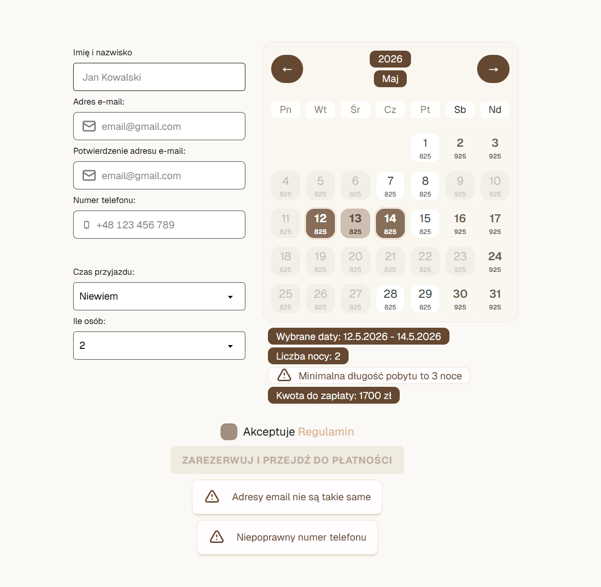
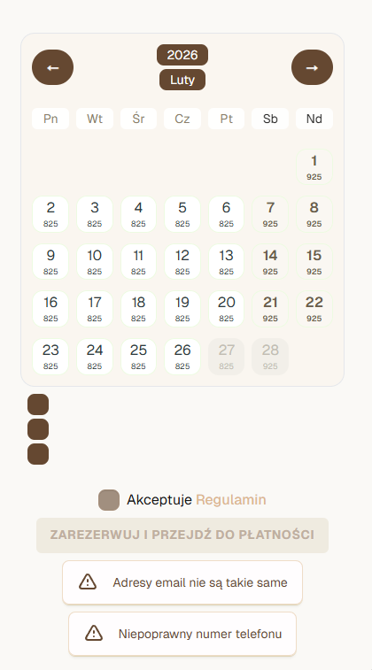
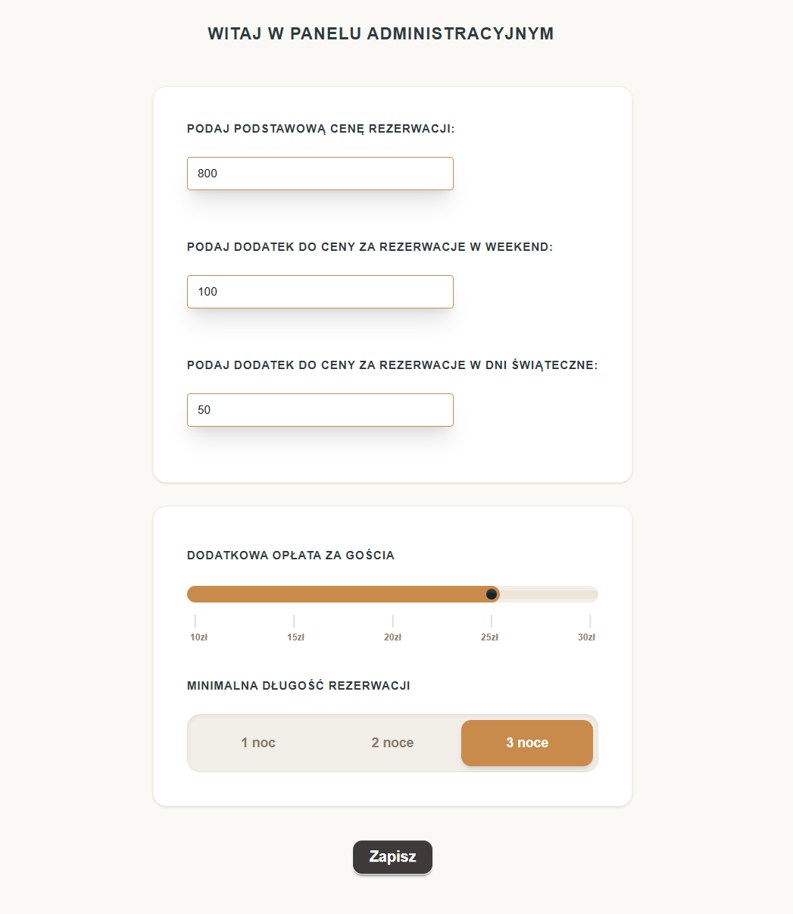
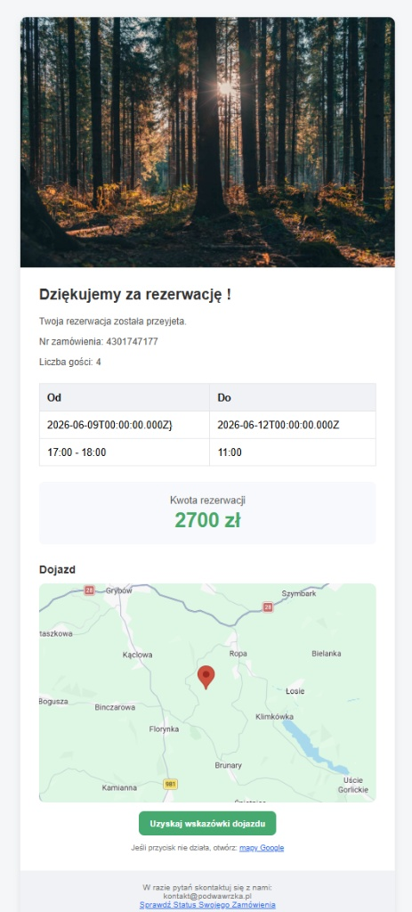
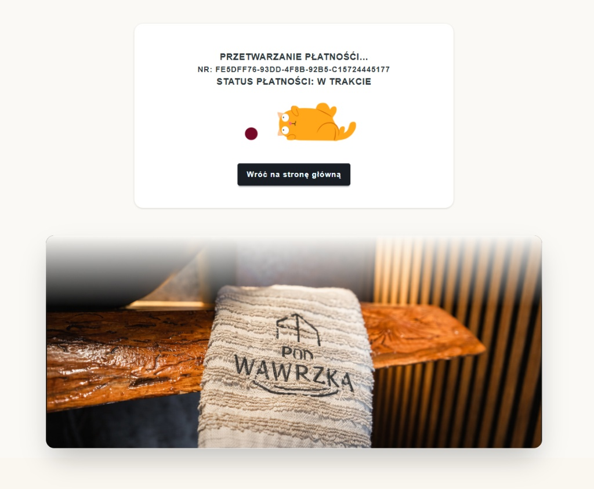

# Podwawrzka Reservation & Payments

Kompletny system rezerwacji pobytu i płatności online dla obiektu noclegowego — zaprojektowany jako produkcyjny projekt full-stack, gotowy do pokazania w CV i na LinkedIn.

To rozwiązanie łączy nowoczesny frontend (Next.js), API backendowe (Express + TypeScript), własny kalendarz rezerwacji, płatności Przelewy24, automatyzację komunikacji (mail + SMS) i panel administracyjny do zarządzania cenami i zasadami pobytu.


---

## Dlaczego ten projekt robi wrażenie?

- Wdrożony **autorski kalendarz rezerwacji** (logika dostępności, zakresów dat i limitów pobytu).
- Integracja płatności online przez **Przelewy24** (obsługa statusów i ścieżki potransakcyjnej).
- **Autentykacja Clerk** dla bezpiecznego dostępu do panelu i operacji administracyjnych.
- Integracje komunikacyjne: **Brevo** (e-mail) + **SMSAPI** (powiadomienia SMS).
- Oddzielona architektura frontend/backend, gotowa do rozwoju i łatwa do utrzymania.

## Najważniejsze funkcje

- Rezerwacja online z walidacją formularza i dynamicznym wyliczaniem ceny.
- Obsługa minimalnej długości pobytu oraz reguł cenowych (weekend/święta/dni specjalne).
- Panel administratora do konfiguracji cennika i parametrów rezerwacji.
- Strony statusów płatności (sukces / błąd / oczekiwanie) z czytelnym UX.
- Powiadomienia transakcyjne wysyłane do klienta po kluczowych etapach procesu.

## Stack technologiczny

### Frontend
- Next.js 15
- React 19
- Tailwind CSS 4
- TypeScript

### Backend
- Node.js + Express 5
- TypeScript
- Drizzle ORM
- SQLite
- Swagger / OpenAPI

### Integracje zewnętrzne
- Przelewy24
- Clerk
- Brevo
- SMSAPI

## Architektura repozytorium

| Ścieżka | Opis |
| --- | --- |
| `frontend/` | Aplikacja kliencka i panel administracyjny |
| `backend/` | API, logika biznesowa, integracje, baza danych |
| `backend/src/routes/` | Endpointy rezerwacji, płatności, ustawień i powiadomień |
| `backend/src/db/` | Schemat bazy i konfiguracja ORM |
| `frontend/src/app/` | Widoki użytkownika, admin i statusy płatności |

## Szybki start (lokalnie)

### 1) Instalacja zależności

```bash
cd backend && npm install
cd ../frontend && npm install
```

### 2) Uruchom backend

```bash
cd backend
npm run dev
```

### 3) Uruchom frontend

```bash
cd frontend
npm run dev
```

## Przykładowa konfiguracja `.env`

Plik `backend/.env`:

```dotenv
PORT=3000
DATABASE_URL=./data/app.db
P24_MERCHANT_ID=""
P24_POS_ID=""
P24_API_KEY=""
P24_CRC=""
P24_SANDBOX=true
BREVO_API_KEY=""
SMSAPI_TOKEN=""
CLERK_SECRET_KEY=""
```

Plik `frontend/.env.local`:

```dotenv
NEXT_PUBLIC_API_URL=http://localhost:3000
NEXT_PUBLIC_CLERK_PUBLISHABLE_KEY=""
```

## Galeria projektu

> Screenshoty umieść w katalogu `docs/screenshots/` pod nazwami jak poniżej.

### Rezerwacja + kalendarz




### Panel administratora



### Statusy i komunikacja






